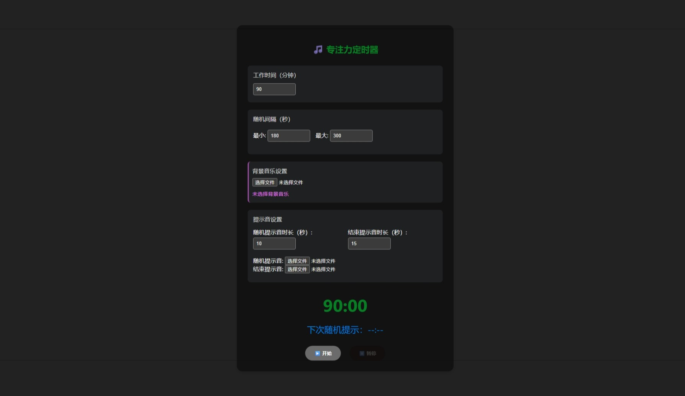

# Random-Reminder-Html
项目参考：https://github.com/ZainZeen/random-reminder

此项目是受到上面这个项目的作者启发，使用html写了一个自定义功能的 ⌈专注力定时器⌋ 工具，下载html后双击打开即可使用！

## 项目简介
⌈专注力定时器⌋ 是一个简单而有效的专注力提升工具。它通过随机时间间隔的提示音来帮助用户保持专注，同时预防视觉疲劳，提高学习和工作效率。

## 核心功能
- 🎯 随机提示：在设定的时间范围内（3-5分钟）随机播放提示音
- 👁️ 微休息提醒：听到提示音后进行10秒钟的闭眼休息
- ⏱️ BRAC理论：90分钟专注 + 20分钟休息的循环模式
- 🎨 简洁界面：专注于核心功能的清爽界面设计

## 使用方法
1. 设置随机提示音的时间范围（默认3-5分钟）
2. 点击开始按钮，进入专注模式
3. 听到提示音时，立即闭眼休息10秒
4. 每专注90分钟后，进行20分钟的充分休息

- 可以上传wav、mp3等格式的音频
- （建议设置背景音乐为雨声等）
- （建议设置随机提示音为铃钹等声音，10秒，正好等于闭眼休息时长）
- （建议设置结束提示音为鼓点强劲的声音，作为结算界面）

## 如何自定义功能
此仓库html代码来源于deepseek，你也可以参照我的步骤，逐步构建自己的功能！

步骤：

我分多次向deepseek提问，让它回复相应的html代码，你需要确保每一次提问得到的html都可以跑通，没跑通的话要纠正它。

- 第一次提问：我看到一个提升专注力的方法，就是设置90分钟为工作时间，在这段时间内随机定时3到5分钟，定时到了之后响起提示音。我希望你将这段程序写为html代码, 可以设置定时时间，可以开始、停止定时。此外我希望设置随机定时间隔（可以为秒）。我希望有两种提示音，随机定时是一个提示音，90分钟到达之后是急促的提示音。如果可以设置提示音的音频文件会更好，如果找不到音频文件则播放默认的提示音。

- 第二次提问：除了总时间倒计时之外，我希望随机间隔时间确定后也在倒计时。随机提示音与结束提示音都增加一个设置，可以设置播放时长。最后，优化一下界面，增加一些样式，看起来更漂亮一点。

- 第三次提问：再增加一个功能，可以上传背景音频，背景音频会重复播放，直到主计时结束。播放两种提示音时，应当降低背景音乐声音，主要播放提示音。

